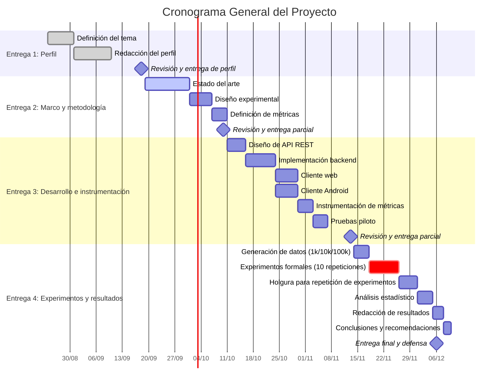

## Planteamiento del problema

Actualmente, el desarrollo de sistemas de información utiliza arquitecturas basadas en APIs REST, las cuales permiten que diferentes aplicaciones accedan a los mismos servicios y datos. En los sistemas de inventario, este enfoque facilita que un mismo backend sea utilizado por clientes web y móviles para realizar operaciones como consultar productos, registrar información y actualizar existencias. Sin embargo, utilizar una misma API no garantiza que los clientes presenten el mismo rendimiento. La norma ISO/IEC 25010 considera el comportamiento temporal y la utilización de recursos como aspectos relacionados con la eficiencia de desempeño de un software (International Organization for Standardization [ISO], 2011). Por ello, el rendimiento de los clientes puede ser analizado mediante mediciones que permitan comparar su comportamiento bajo condiciones determinadas.

Esta situación adquiere mayor importancia cuando aumenta la cantidad de información procesada. En un sistema de inventario, las operaciones CRUD pueden realizarse sobre diferentes volúmenes de registros, lo que puede afectar el tiempo necesario para solicitar, recibir y procesar los datos. Al utilizar una misma API REST conectada a SQL Server, un cliente web desarrollado con HTML, CSS y JavaScript y un cliente Android desarrollado con Kotlin pueden presentar diferencias en el tiempo de respuesta y el consumo de memoria, debido a las características propias de cada plataforma.

Existen investigaciones que respaldan la importancia de analizar estas diferencias. Kaczmarczyk et al. (2022) compararon aplicaciones Android nativas e híbridas que procesaban información obtenida mediante una REST API y observaron variaciones en los tiempos de procesamiento al trabajar con diferentes cantidades de datos. Por otra parte, Pratama et al. (2025) evaluaron aplicaciones Android que utilizan REST API mediante métricas como tiempo de respuesta, uso de red y consumo de memoria. Estos antecedentes muestran que el rendimiento de los clientes puede estudiarse mediante métricas cuantificables y que el volumen de información procesada puede influir en su comportamiento.

A partir de estos antecedentes, se identifica la necesidad de realizar una comparación específica entre un cliente web y un cliente Android que consuman una misma API REST conectada a SQL Server, bajo condiciones equivalentes. Aunque existen investigaciones sobre el rendimiento de aplicaciones móviles y servicios REST, los estudios revisados utilizan diferentes tecnologías y escenarios de prueba. Por ello, resulta necesario analizar el comportamiento de ambos tipos de clientes al ejecutar operaciones CRUD sobre diferentes volúmenes de información. En esta investigación se utilizarán conjuntos de 1.000, 10.000 y 100.000 registros, realizando 10 ejecuciones por cada combinación para obtener mediciones comparables del tiempo de respuesta y el consumo de memoria.

Pregunta de investigación

Principal:

¿Qué diferencias de tiempo de respuesta y consumo de memoria existen entre un cliente web y un cliente Android al consumir una API REST de un sistema de inventario con SQL Server, al ejecutar operaciones CRUD sobre conjuntos de 1.000, 10.000 y 100.000 registros, considerando el promedio de 10 ejecuciones por combinación?

Secundarias:

¿Cómo varía la diferencia entre web y Android según el tipo de operación (lectura vs. escritura)?

¿Qué configuración del cliente (caché, compresión, paginación) reduce la brecha observada?

¿A partir de qué volumen de registros la diferencia se vuelve significativa en términos prácticos? 

## Delimitación del problema

- **Teórica:** La investigación se fundamentará en el Modelo de Calidad de Software ISO/IEC 25010, enfocándose exclusivamente en la característica de «Eficiencia de desempeño» (y sus subcaracterísticas de comportamiento temporal y utilización de recursos) para establecer la comparativa entre los clientes Web y Android.

- **Temporal:** La recolección de los datos y las mediciones de rendimiento de la API se realizarán durante un periodo de 4 semanas, comprendido entre la semana 8 y la semana 11 del ciclo académico 02-2026.

- **Espacial o de contexto:** El estudio se aplicará sobre un sistema de inventario controlado, evaluando específicamente 5 endpoints de la API REST encargados de las operaciones CRUD (creación, lectura, actualización y eliminación) del catálogo de productos y existencias.

- **Tecnológica:** El proyecto y las mediciones se ejecutarán utilizando las siguientes especificaciones exactas:

  - **Base de datos:** Microsoft SQL Server 2022
  - **Backend / API:** Java 21 con Spring Boot 3.3
  - **Cliente Web:** HTML5 + CSS3 + JavaScript (Chrome 128)
  - **Cliente Android:** Kotlin 2.0 con Retrofit 2.11 (Android 14, API 34)
  - **Hardware y SO de pruebas:**
    - **Servidor local:** Intel Core i5-11400, 16 GB RAM, Windows 11
    - **Dispositivo móvil:** Android 14, 8 GB RAM
   
## Objetivos

### General

Comparar el rendimiento (tiempo de respuesta y consumo de memoria) entre un cliente web y un cliente Android al consumir los mismos endpoints de una API REST conectada a un sistema de inventario con SQL Server, con el fin de determinar qué plataforma ofrece mejor eficiencia bajo condiciones equivalentes de uso, con cargas de 1,000 , 10,000 y 100,000 registros.

### Específicos

1. **Diseñar e implementar una API REST** para la gestión de inventario (operaciones CRUD sobre productos, categorías y movimientos de stock) conectada a una base de datos SQL Server.
2. **Desarrollar un cliente web y un cliente Android** funcionalmente equivalentes, que consuman los mismos endpoints de la API bajo idénticas condiciones de red y configuración.
3. **Diseñar e implementar un mecanismo de instrumentación** para capturar, de forma automatizada, el tiempo de respuesta (latencia por petición) y el consumo de memoria (RAM) en cada cliente durante el consumo de la API.
4. **Ejecutar pruebas controladas** de 10 repeticiones por cada combinación de cliente y endpoint, calculando el promedio, la desviación estándar y el coeficiente de variación de los resultados obtenidos.
5. **Analizar estadísticamente los resultados** para identificar los umbrales (volumen de datos, tipo de operación o tamaño de payload) en los que la diferencia de rendimiento entre ambos clientes se vuelve significativa.
6. **Formular recomendaciones de diseño** orientadas a arquitecturas de doble canal (web y móvil), basadas en los hallazgos, que orienten decisiones sobre distribución de carga, optimización de consultas o elección de plataforma según el contexto de uso.

# Justificación

El presente proyecto, titulado **"Comparación del rendimiento web y Android al consumir una API REST para un sistema de inventario con SQL Server"**, surge de la necesidad de conocer cómo se comportan diferentes plataformas al consumir los mismos servicios de una API REST. Desde el punto de vista técnico, la comparación del tiempo de respuesta y el consumo de memoria permitirá obtener información que sirva como referencia para tomar decisiones sobre la plataforma cliente más adecuada al desarrollar sistemas de inventario, considerando diferentes volúmenes de información.

Desde el punto de vista académico, el proyecto permitirá generar datos comparativos sobre el rendimiento de un cliente web y uno Android utilizando una misma API REST y una base de datos SQL Server, aportando evidencia obtenida mediante pruebas controladas y métricas de rendimiento.

En el ámbito profesional, los resultados podrán ser de utilidad para desarrolladores y organizaciones que necesiten implementar sistemas de inventario multiplataforma, ya que proporcionarán información sobre el comportamiento de ambas alternativas en condiciones equivalentes. Además, el proyecto permitirá aplicar conocimientos de desarrollo web y móvil, APIs REST, SQL Server y evaluación del rendimiento de sistemas.

# Cronograma General del Proyecto

## Responsables
- **Web:** VENTURA SIBRIAN RENÉ DANIEL Y RIVERA LÓPEZ MIGUEL ANGEL
- **Móvil:** CHICAS MARTÍNEZ DIEGO ALBERTO Y GRANDE LORENZANA JOSÉ DAVID
- **APIs:** GUILLEN CAMPOS ALEJANDRA CAROLINA Y RAMÍREZ RAMÍREZ NELSON EDUARDO

## Viabilidad Técnica de Investigacion

La presente investigación se considera técnicamente viable debido a que todas las tecnologías, herramientas y recursos requeridos para su desarrollo son de acceso libre, gratuito o ya se encuentran disponibles dentro del entorno de trabajo. Esto permite realizar la implementación y evaluación sin incurrir en costos adicionales de licenciamiento o adquisición de infraestructura.

Para el desarrollo de la solución se utilizarán las siguientes tecnologías:

- **Base de datos:** SQL Server 2022 (edición Developer o Express), disponible gratuitamente para entornos de desarrollo y pruebas.
- **Backend y APIs:** Java 21 con Spring Boot 3.3, empleando OpenJDK y librerías con licencia Apache 2.0.
- **Cliente web:** HTML5, CSS3 y JavaScript, ejecutados y evaluados mediante Google Chrome versión 128.
- **Cliente móvil:** Kotlin 2.0 con Retrofit 2.11 sobre dispositivos con Android 14.

La obtención y análisis de métricas de rendimiento se realizará mediante herramientas especializadas y de libre acceso, entre ellas:

- Scripts personalizados para la automatización de pruebas.
- Android Profiler para la medición de consumo de recursos en la aplicación móvil.
- Android Debug Bridge (ADB) para la captura y monitoreo de métricas del dispositivo.
- Python, junto con las bibliotecas **pandas** y **scipy**, para el procesamiento de datos y el análisis estadístico de los resultados obtenidos.

### Recursos de Hardware

El proyecto cuenta con la infraestructura necesaria para su ejecución:

- **Servidor local:** Intel Core i5-11400, 16 GB de memoria RAM y sistema operativo Windows 11.
- **Dispositivo móvil:** Smartphone con Android 14 y 8 GB de memoria RAM.

Ambos equipos se encuentran disponibles para el equipo de investigación, por lo que no se requiere inversión adicional en hardware.

### Datos de Prueba

Con el fin de garantizar la seguridad de la información, la repetibilidad de los experimentos y la validez de los resultados, se emplearán datos sintéticos generados dentro del propio sistema de inventario. Los escenarios de prueba contemplarán conjuntos de datos con volúmenes de:

- 1,000 registros
- 10,000 registros
- 100,000 registros

Esta estrategia elimina la necesidad de utilizar información sensible o confidencial y permite reproducir las pruebas bajo condiciones controladas.

### Análisis de Riesgos y Medidas de Mitigación

Aunque se identifican algunos riesgos técnicos potenciales, todos cuentan con estrategias de mitigación viables que reducen significativamente su impacto en la investigación.

#### 1. Variaciones en las condiciones de red
Las diferencias en la calidad de la conexión podrían afectar los tiempos de respuesta observados entre las aplicaciones web y móvil.

**Medida de mitigación:**  
Realizar las pruebas dentro de una misma red local (LAN) utilizando un servidor local dedicado, garantizando condiciones homogéneas para ambos clientes.

#### 2. Diferencias en la medición de memoria entre plataformas
Los mecanismos de monitoreo disponibles para aplicaciones web y móviles no son exactamente equivalentes.

**Medida de mitigación:**  
Reportar las métricas de memoria de forma independiente para cada plataforma, utilizando `performance.memory` en el cliente web y **Android Profiler** en el cliente móvil, manteniendo criterios de análisis consistentes.

#### 3. Variabilidad producida por procesos en segundo plano
La ejecución de servicios externos o aplicaciones residentes puede introducir fluctuaciones en los resultados.

**Medida de mitigación:**  
Realizar diez repeticiones por cada escenario de prueba, reiniciar los servicios antes de cada medición y calcular medidas estadísticas de dispersión, como la desviación estándar, para identificar posibles anomalías.

### Conclusión

Considerando la disponibilidad de herramientas, recursos de hardware, tecnologías de desarrollo y mecanismos de mitigación de riesgos, se concluye que el proyecto posee las condiciones necesarias para su ejecución. Los riesgos identificados presentan una probabilidad e impacto bajos y cuentan con planes alternativos claramente definidos, por lo que la **viabilidad técnica de la investigación se considera aprobada**.

## Referencias

- Android Developers. (s. f.). *Overview of memory management*. Google. https://developer.android.com/topic/performance/memory-overview

- Chrome for Developers. (s. f.). *Network features reference*. Google. https://developer.chrome.com/docs/devtools/network/reference/

- International Organization for Standardization. (2011). *ISO/IEC 25010:2011: Systems and software engineering—Systems and software Quality Requirements and Evaluation (SQuaRE)—System and software quality models*. ISO.

- Kaczmarczyk, A., Zając, P., & Zabierowski, W. (2022). Performance comparison of native and hybrid Android mobile applications based on sensor data-driven applications based on Bluetooth Low Energy (BLE) and Wi-Fi communication architecture. *Energies, 15*(13), 4574. https://doi.org/10.3390/en15134574

- Pratama, B. M. H., Hanggara, B. T., & Putra, W. H. N. (2025). Analisis perbandingan performa networking library Retrofit dan Volley dalam pengambilan data menggunakan REST API. *Jurnal Pengembangan Teknologi Informasi dan Ilmu Komputer, 9*(4).
   
