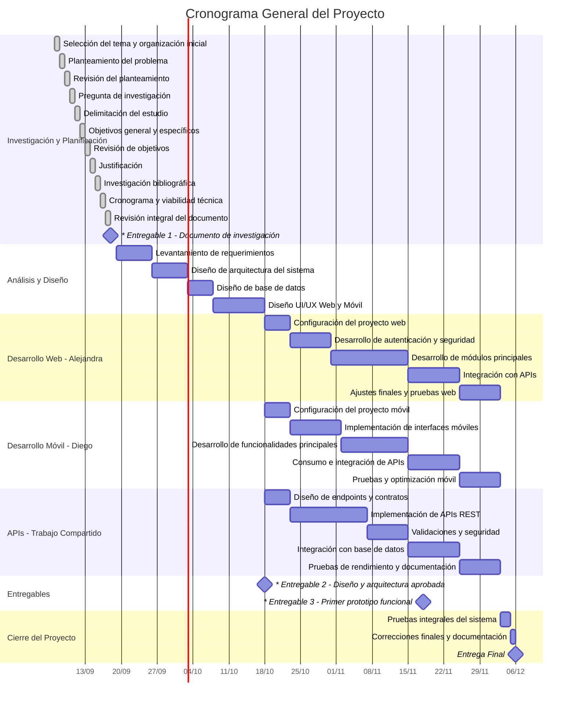

# Cronograma General del Proyecto

## Responsables
- **Web:** VENTURA SIBRIAN RENÉ DANIEL Y RIVERA LÓPEZ MIGUEL ANGEL
- **Móvil:** CHICAS MARTÍNEZ DIEGO ALBERTO Y GRANDE LORENZANA JOSÉ DAVID
- **APIs:** GUILLEN CAMPOS ALEJANDRA CAROLINA y RAMÍREZ RAMÍREZ NELSON EDUARDO

